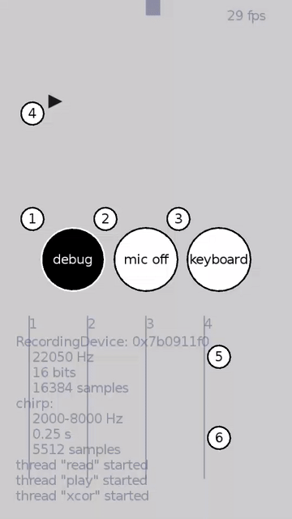

Chirpy is an audio text messaging app.

Chirpy is a fun demonstration of chirp modulation.

## Install

Download the latest Android Package (APK):
[chirpy-0.1.apk](https://github.com/eliteraspberries/chirpy/releases/tag/v0.1)

## Usage

On screen you will see three buttons (①, ②, ③), text input or received (④),
and plots of the decoding process (⑤, ⑥).

 1. The 'debug' button toggles the information displayed in the background.
 2. The 'mic' button toggles the decoding process.
    Turn this off when not in use because it consumes battery.
 3. The 'keyboard' button toggles keyboard input.
 4. Text sent or received is displayed at the top of the screen.
 5. and 6 are plots of the cross-correlation of the audio received and
    the zero and one chirps.
    A peak indicates the presence of a chirp.

## Requirements

The Chirpy app requires:

  - a 32-bit ARM CPU (ARMv7-A) with VFP coprocessor (VFPv4); and
  - Android version 4.4 (KitKat) or later.

That means most Android smartphones except the newest ones.

Building Chirpy requires:

  - a [Unix shell and utilities][unix] including [make][];
  - [GNU Autotools][autotools] (Autoconf, Automake, and Libtool);
  - [Python][] and [SCons][];
  - the awesome [LÖVE][] framework;
  - the [FFTW][] library and [lua-libfftw][];
  - the [Nu][] library and [lua-libnu][];
  - the [android-env][] script;
  - the [DejaVu][] Sans font; and
  - [Android Studio][].

## Build

First, install [Android Studio][].

Then fetch this repository and change into its directory:

    $ git clone https://github.com/eliteraspberries/chirpy.git
    $ cd chirpy

Download, extract, and patch LÖVE for Android version 11.1:

    $ curl -L -O https://bitbucket.org/rude/love/downloads/love-11.1-android-source.tgz
    $ gunzip < love-11.1-android-source.tgz | tar -f - -x
    $ patch -b -p0 < patches/patch-love-11.1-android-source

Copy everything in the `love-11.1-android-source` directory into the
`chirpy-android` directory, without overwriting files:

    $ cp -R -n love-11.1-android-source/ chirpy-android/

Note the trailing slashes in the command above.

Download, extract, and patch FFTW version 3.3.4:

    $ curl -L -O http://www.fftw.org/fftw-3.3.4.tar.gz
    $ gunzip < fftw-3.3.4.tar.gz | tar -f - -x
    $ patch -b -p0 < patches/patch-fftw-3.3.4

Download and extract Nu version 0.6:

    $ curl -L -O https://github.com/eliteraspberries/nu/releases/download/v0.6/nu-0.6.tar.gz
    $ gunzip < nu-0.6.tar.gz | tar -f - -x

Download lua-libfftw:

    $ git clone https://github.com/eliteraspberries/lua-libfftw.git
    $ cp -R lua-libfftw/libfftw .

Download lua-libnu:

    $ git clone https://github.com/eliteraspberries/lua-libnu.git
    $ cp lua-libnu/libnu.lua .

Download the android-env script:

    $ git clone https://github.com/eliteraspberries/android-env.git
    $ cp android-env/android-env.sh .

Download the latest version of the DejaVu Sans font:

    $ curl -L -O https://github.com/dejavu-fonts/dejavu-fonts/releases/download/version_2_37/dejavu-fonts-ttf-2.37.zip
    $ unzip -j dejavu-fonts-ttf-2.37.zip dejavu-fonts-ttf-2.37/ttf/DejaVuSans.ttf -d fonts

Build everything:

    $ make apk

Finally, open the project directory `chirpy-android` in Android Studio,
and select 'Make Project' from the 'Build' menu.

[Android Studio]: <https://developer.android.com/studio/>
[DejaVu]: <https://dejavu-fonts.github.io/>
[FFTW]: <http://www.fftw.org/>
[LÖVE]: <https://love2d.org/>
[Nu]: <https://github.com/eliteraspberries/nu>
[Python]: <https://www.python.org/>
[SCons]: <https://scons.org/>
[android-env]: <https://github.com/eliteraspberries/android-env>
[autotools]: <https://www.gnu.org/software/automake/>
[lua-libfftw]: <https://github.com/eliteraspberries/lua-libfftw>
[lua-libnu]: <https://github.com/eliteraspberries/lua-libnu>
[make]: <http://pubs.opengroup.org/onlinepubs/9699919799/utilities/make.html>
[unix]: <http://pubs.opengroup.org/onlinepubs/9699919799/utilities/contents.html>
